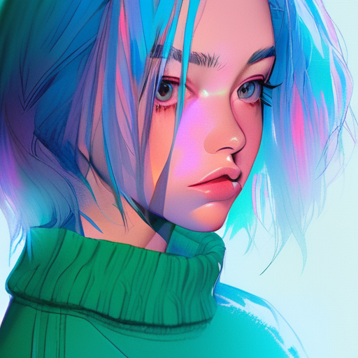

# Intro 

## An AI friend throws me this 🤖

<b>Stable Diffusion</b> and <b>Midjourney</b> are both generative artificial intelligence models that create images from text prompts. 

Here are some key differences and similarities between them:

<h4>Developer and Release Date:</h4>

- Stable Diffusion was developed by researchers from the CompVis Group at Ludwig Maximilian University of Munich and Runway with a compute donation by Stability AI. It was released in 20221.

- Midjourney was created and hosted by San Francisco-based independent research lab Midjourney, Inc. It entered open beta on July 12, 20222.

<h4>Technology:</h4>

- Stable Diffusion is a deep learning, text-to-image model based on diffusion techniques. It’s a latent diffusion model, a kind of deep generative artificial neural network.

- Midjourney also generates images from natural language descriptions, called "prompts".

<h4>Accessibility:</h4>

- Stable Diffusion’s code and model weights have been released publicly, and it can run on most consumer hardware equipped with a modest GPU with at least 8 GB VRAM.

- Midjourney is currently only accessible through a Discord bot on their official Discord server.

<h4>License:</h4>

- Stable Diffusion is available under the Creative ML OpenRAIL-M license.
The software release of Midjourney is not specified in the search results.

<h4>Usage:</h4>

- Stable Diffusion is primarily used to generate detailed images conditioned on text descriptions, though it can also be applied to other tasks such as inpainting, outpainting, and generating image-to-image translations guided by a text prompt1.

- Users create artwork with Midjourney using Discord bot commands.
In summary, both Stable Diffusion and Midjourney are powerful tools for generating images from text prompts. They differ mainly in their development, technology, accessibility, and usage.


## Mine version: 😥

- It's free and run locally on Mac M1.
- The community is bigger.
- How's kool it that!

# Installation 
## Architect 
It's include the FrontEnd and the Backend.

- Our FrontEnd uses: https://github.com/AUTOMATIC1111/stable-diffusion-webui

- Our Backend will be any model (checkpoint) which we can access

# Install 

## Frontend 
Follow this to get the lastest.

https://github.com/AUTOMATIC1111/stable-diffusion-webui/wiki/Installation-on-Apple-Silicon

My specs:
  💻 Macbook Pro 
  - Chip: M1 Pro
  - Memory: 32 GB
  - Disk: 1T 

I don't need this step 

~~brew install cmake protobuf rust python@3.10 git wget~~

```bash
git clone https://github.com/AUTOMATIC1111/stable-diffusion-webui
cd stable-diffusion-webui
./webui.sh
```

## Update 

`git pull`

### Backend 

The models I downloaded are relatively `small` in size. I first tested the base model. If necessary, create an account with HuggingFace. 

[Stable DIffusion 1.4 (sd-v1-4.ckpt)](https://huggingface.co/CompVis/stable-diffusion-v-1-4-original)


My review: It’s great for creating fantasy characters, but not so good for humans. 

I used a model from the Vietnamese community to create a high-quality female character. 

https://civitai.com/models/123307/sdvn7-nijistylexl

My review: It’s definitely better. 

## How to use 

This one is quite detailed. 

https://github.com/AUTOMATIC1111/stable-diffusion-webui/wiki/Features

For me, I simply leave all parameters at their default settings, input the prompt, and then press the Generate button. I plan to delve deeper into it later.


# Showcases


1st | 2nd | 3rd
:--: | :--:| :--:
 |  | 


# Generative ai terms  
## Lora  
  LoRA: Low-Rank Adaptation of Large Language Models is a novel technique introduced by Microsoft researchers to deal with the problem of fine-tuning large-language models
  https://huggingface.co/blog/lora

  While Stable Diffusion can generate images from text prompts, adding a control mechanism like LoRa can give you more influence over the specifics of those generated images. 

## ControlNet 
  While Stable Diffusion is capable of generating images from text, ControlNet provides an additional layer of control over the specifics of those generated images.
  https://huggingface.co/docs/diffusers/main/en/api/pipelines/controlnet_sdx

## RLHF: 
  Reinforcement Learning from Human Feedback
  https://huggingface.co/blog/rlhf

## Run inference
  RI is the process of running live data points into a machine learning algorithm (or “ML model”) to calculate an output such as a single numerical score


<p></p>

## Author

This repo was developed by [@lamha](https://github.com/HaLamUs). 
Follow or connect with me on [my LinkedIn](https://www.linkedin.com/in/lamhacs). 

## License
The source code for the site is licensed under the MIT license, [MIT](https://opensource.org/license/mit/)


